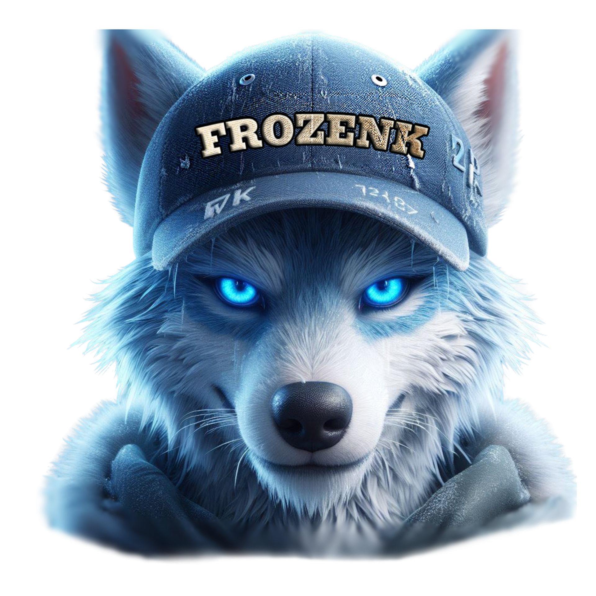
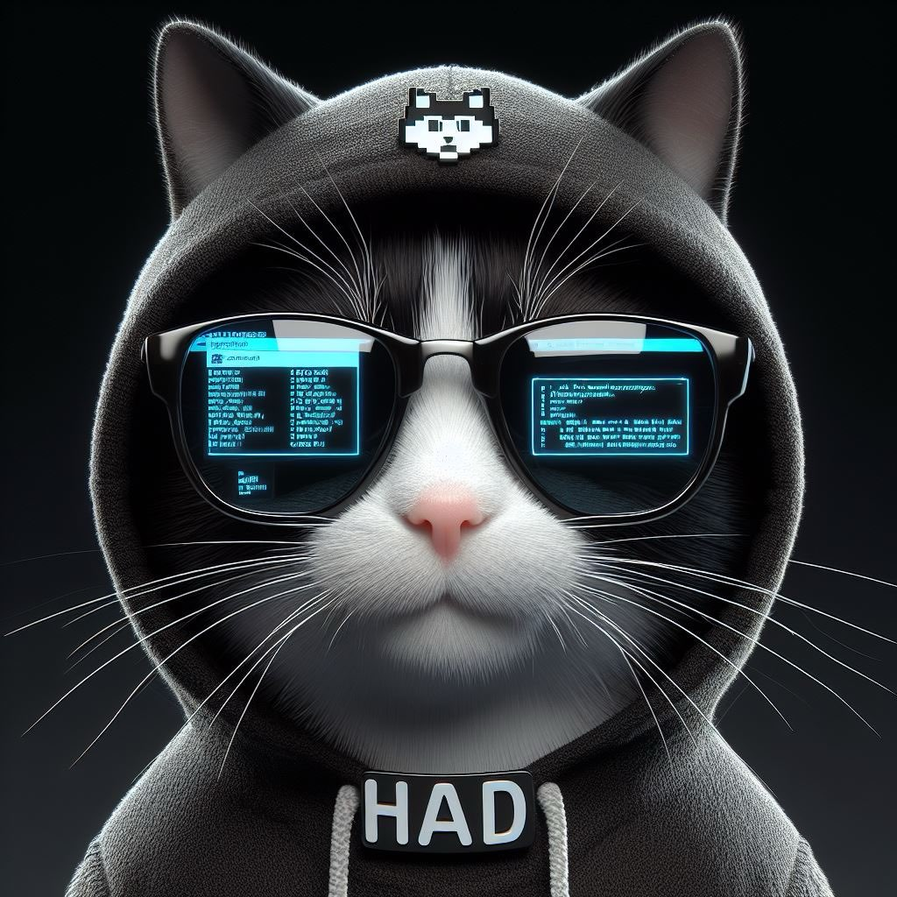
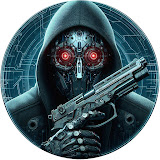
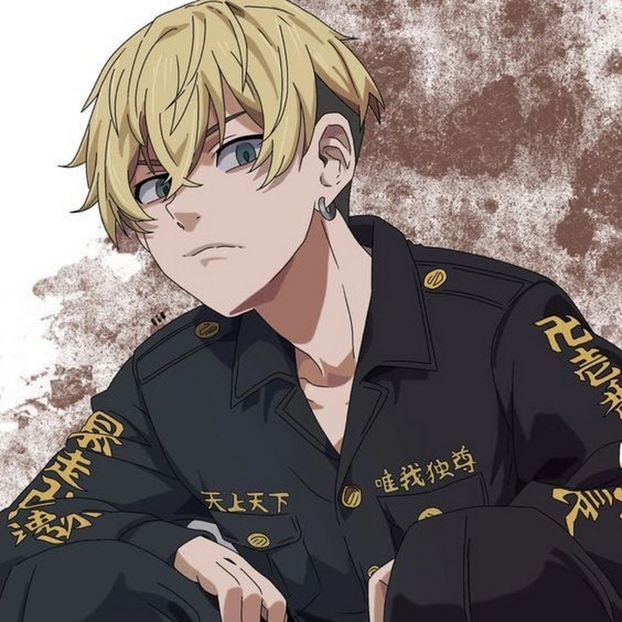

import { CardGrid } from '@astrojs/starlight/components'
import Card from '../../../components/starlight/Card.astro'
import ListCard from '../../../components/starlight/ListCard.astro'
import SplitCard from '../../../components/starlight/SplitCard.astro'

    <iframe style="width: 100%; height: 100%;" 
            src="https://www.youtube.com/embed/LaLIlVQyufM?si=xxg65jqXbhySl2Jy&autoplay=1&mute=1" 
            title="YouTube video player" 
            frameborder="0" 
            allow="accelerometer; autoplay; clipboard-write; encrypted-media; gyroscope; picture-in-picture; web-share" 
            allowfullscreen>
    </iframe>

La communauté **Hacking-France** (originellement CTF-Hacking-France) a été créée sur discord par Frozenk dans le but de réunir les joueurs de CTF et de proposer des « [talks](https://hacking-france.fr/events/talks/) » sur divers sujets de la cybersécurité. Aujourd’hui, elle rassemble plus de 1500 personnes, avec des dizaines de célébrités du domaine de la cybersécurité venues présenter leurs conférences et des CTF organisés spécifiquement pour ses membres.

> Le cœur de cette communauté est la bienveillance et le partage, **et cela restera ainsi !**
## Les administrateurs :
<CardGrid>

  <Card title="👑">
  ### Frozenk
    

      
    

    
Chris, Pentester issu d’une reconversion, créateur de la communauté Hacking-France et petit youtubeur en cybersécurité, je suis passionné par les CTF et autres challenges.

    
Je m’efforce d’aider au maximum les personnes, en particulier les débutants.

    
« On est tous le nul de quelqu’un d’autre », alors ne prenez jamais la grosse tête ! 🙂

    

      <a href="https://www.youtube.com/@FrozenKwa">Sa chaine Youtube</a> 
      <a href="https://github.com/Frozenka">Github</a>
    

  </Card>

  <Card title="👑" >
  ### Had
    

      
    

    
Hadrien, sysadmin en alternance, mes missions tournent autour de tout ce qui est supervision, cartographie de SI avec un peu de gestion de projet.

    
Pour éviter de sombrer dans la gestion de projet, il m’arrive de faire des streams sur des box vulnlab, hackthebox (un peu de dev) les soirs.

    

      <a href="https://www.twitch.tv/hadzah_fr">Sa chaine Twitch</a> 
      <a href="https://hadrien.cat/">Site de Had</a>
    

  </Card>

  <Card title="👑">
  ### Cyberretta
    

      
    

    
Jean-Loup, full autodidacte depuis l’obtention de mon BTS SN car je n’ai pas souhaité continuer l’école.

    
Je m’intéresse à la sécurité défensive et offensive (mais surtout offensive) 🛡️.

    
Je passe aussi mon temps sur des projets perso (souvent du dev C++), et j’ai créé une chaîne YouTube pour partager ce qui me plaît 😄.

    

      <a href="https://cyberretta.github.io/">Site de Cyberretta</a>
    

  </Card>
</CardGrid>
## Les modérateurs :
<CardGrid>
  <Card title="🛡️">
  ### Tux
    

      
    

    
Vladimir, passionné d’informatique depuis plusieurs années.

    
Je travaille actuellement dans les réseaux et les systèmes, notamment sur tout ce qui concerne le hardening d’Active Directory, l’analyse de logs, la supervision, etc.

    
Je suis également passionné par l’OSINT et le pentest, que je pratique sur mon temps personnel.

  </Card>

  <Card title="🛡️">
  ### Foxx24
    

      
    

    
Passionné par la cybersécurité, je consacre autant de temps que possible à approfondir mes connaissances et mes compétences dans ce domaine. Malgré les études, j’essaie de m’investir au maximum afin de progresser dans ce domaine en constante évolution.

  </Card>

  <Card title="🛡️">
  ### LightRadio
    

      
    

    
Patrice, reparti sur les bancs de l’école après une reconversion, prochainement en alternance master cybersécurité.

    
Je suis passionné par pas mal (trop) de choses : le pentest, l’analyse forensique, le dev de tool (python).

    
J’aime également l’OSINT et le lockpicking. Et quand les journées feront + de 4h je me mettrais à l’analyse et au dev de malware.

    
J’ai une soif d’apprendre mais aussi un plaisir à partager et aider quand j’en ai la possibilité.

    

      <a href="https://github.com/LightxR">Github de Light</a>
    

  </Card>

</CardGrid>
